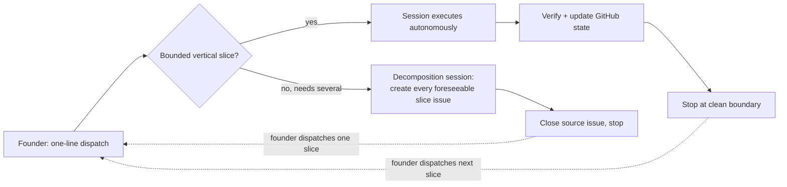

# Loop-Dee-Loup

An opinionated, token-lean execution loop for autonomous coding agents.

## The problem

Long-running agentic coding sessions get expensive in a predictable way: context balloons, the founder becomes a message bus relaying status between themselves and an agent that already has the answer, and review turns into serial back-and-forth. Loop-Dee-Loup treats agent sessions as disposable and GitHub (issues, PRs, compact snapshots) as the durable state, so a founder can dispatch one bounded unit of work with a single line, let the agent run autonomously to a clean stop, and resume later from GitHub instead of from a long-lived conversation.

## What it is

The founder starts or resumes a Claude Code session with a terse issue reference:

> Run Loop-Dee-Loup issue #12.

If the issue is one bounded vertical slice, the session executes it autonomously, verifies the result, updates durable GitHub state, and stops. If it genuinely needs multiple independently executable slices, the session decomposes it into durable issues instead of executing any of them, and the founder dispatches whichever runs next.

See [Version-one dispatch](#version-one-dispatch) below for the full contract.

## Who it's for

LDL fits you if you want:

- low token/context cost prioritized over conversational hand-holding;
- disposable agent sessions rather than long-lived chats kept alive for context;
- durable state in GitHub — issues, PRs, repository docs — instead of chat transcripts;
- high agent autonomy once an outcome is authorized;
- founder interruptions reserved for genuine judgment, credentials, or manual-action calls;
- batched decisions instead of serial one-question-at-a-time discovery;
- bounded reviews with explicit stopping conditions instead of open-ended review tennis.

LDL is probably not for you if you want heavyweight upfront planning before any execution, a highly conversational or long-lived working session, or a general-purpose multi-agent orchestration platform — LDL deliberately has no daemon, queue, or automatic session launcher (see Non-goals in `docs/experiment-brief.md`). Those are reasonable preferences; they're just not what this repository optimizes for.

## Relationship to Vibecoding Common Sense

Loop-Dee-Loup (LDL) is not Vibecoding Common Sense (VCS), and isn't a replacement for it.

VCS is a set of broadly applicable safeguards for anyone using AI coding agents — whatever methodology you use, avoid these predictable mistakes. It's meant to stay compatible with BMAD, ad-hoc agent use, long-running sessions, other orchestration systems, or whatever workflow you already run.

LDL is one specific, opinionated way of organizing agentic development. Its proposition is narrower: if you value low token/context cost, high agent autonomy, minimal founder interruption, disposable sessions, and an execution model that scales without turning the founder into a message bus, this is that way of working. These are optimization choices, not universal truths — someone who prefers BMAD, heavyweight upfront planning, highly conversational development, or long-lived sessions may reasonably prefer those instead. LDL is for people whose priorities already align with its own.

## Try it

1. Clone this repository.
2. From the clone, run the bootstrap tool against your own project (it doesn't need to be empty or fresh): `node tools/ldl-init/index.mjs --dest <path-to-your-project>`.
3. If your project already had its own `AGENTS.md`, the installer parks the derived LDL contract at `.ldl/AGENTS.template.md` instead of overwriting it — review and merge that template into your `AGENTS.md` by hand before dispatching anything, or a session will run under your old instructions without LDL's contract. If you had no `AGENTS.md`, the installer wrote one directly and you can skip this step.
4. From inside your project, dispatch one issue with a one-line reference, e.g. `Run Loop-Dee-Loup issue #12.`

See `docs/consumer-quickstart.md` for the full quickstart — obtaining LDL, what gets installed vs. what stays yours, where to start your agent session, how to update, and what remains authoritative in your own repository — and `docs/consumer-contract.md` for the exact ownership boundary. Version one is written against Claude Code sessions; Covenant, used as the worked example throughout this README, is the founder's own separate product and not a dependency — you don't need to reproduce that exact stack to use LDL.

## Design doctrine

- The execution issue is a subagent-sized vertical slice: one coherent outcome, implemented through every layer it requires.
- A slice must be independently verifiable and leave the product and repository in a valid state.
- Internal steps such as inspect, implement, test, document, and review stay inside the slice.
- Decomposition and execution are separate control boundaries: materialize every currently foreseeable slice when an issue genuinely needs several, but do not predict an entire project hierarchy before current evidence exists.
- Agent sessions are disposable. The founder starts or resumes one with a short issue reference.
- Durable state is a compact snapshot, not a transcript.
- Verification evidence advances the loop. Status prose does not.
- After dispatch, routine technical choices and handoffs are autonomous.
- Existing repository safety, review, merge, and release rules remain authoritative.

## Version-one dispatch

No daemon or automatic session launcher is required.

The founder starts a fresh Claude Code session with a terse instruction such as:

> Run Loop-Dee-Loup issue #12.

The issue and repository provide the context. If the issue is one bounded vertical slice, Claude executes autonomously until it is complete or a genuine interrupt condition is reached, updates durable GitHub state, and ends the session. If the issue genuinely requires multiple slices, Claude instead decomposes it — creating a durable issue for every currently foreseeable slice and closing the source — without executing any of them. The founder starts another fresh session to dispatch whichever slice runs next.

This single-line dispatch is scheduling, not a routine approval gate.

## Vertical-slice test

Create an execution issue only when all are true:

- it produces one observable capability, correction, or closure outcome;
- one agent session can own it with bounded context;
- it includes the code, tests, configuration, documentation, and verification needed for that outcome;
- it can be evaluated without completing a sibling issue first;
- merging it leaves the target repository coherent.

Do not split one outcome into separate issues for research, backend, UI, tests, documentation, or PR administration merely because those are different activities. Keep them inside the slice. Create a new issue when the outcome, authority boundary, or required context genuinely changes.

## Decomposition boundary

When one issue turns out to require multiple independently executable vertical slices, decomposition and execution are separate control boundaries.

The session determining that becomes a decomposition session: it creates a durable execution issue for every currently foreseeable, implementation-ready slice (not speculative ones whose shape depends on an outcome not yet known), records genuine dependencies between them, closes the source issue as a decomposition record, and stops — without implementing any resulting slice.

A resulting slice begins only when the founder explicitly dispatches it in a fresh session. Creating a slice, even in the same decomposition session, does not authorize starting it. CLEAN completion of one dispatched slice does not authorize starting a sibling from the same decomposition; the founder chooses what runs next. See `AGENTS.md` § Decomposition boundary.

## Founder decision forms

Do not conduct serial one-question-at-a-time discovery.

Before asking for founder input, inspect the proposal, repository authority, and currently visible critical path. If more than one founder-level question is known, generate one self-contained decision form that the founder can complete asynchronously and return as a whole.

Each question must include:

- why the answer blocks or changes a vertical slice;
- two or three mutually exclusive options when appropriate;
- a recommended option and its tradeoffs;
- a suggested default response;
- a free-comment field.

Finish with a general comments field for constraints or alternatives the form did not anticipate.

After the completed form returns:

1. write settled answers into the parent snapshot;
2. convert the critical-path outcome into implementable vertical slices;
3. identify accepted independent outcomes and route them to the correct Burn Order: a target repository's own (not something Loop-Dee-Loup creates or owns), or Loop-Dee-Loup's own (`docs/burn-order.md`) when the outcome is about the Loop itself;
4. discard rejected options and avoid turning every suggestion into backlog work;
5. generate another form only if the answers expose new founder-level blockers that could not reasonably have been included earlier.

If two decision-form rounds produce no implementable slice, diagnose the proposal or decomposition before generating the next form. Use that diagnosis to consolidate or redirect the critical path rather than repeating the same questionnaire.

## Core loop

1. Capture a feature proposal and create or refresh its compressed parent issue.
2. Analyze the currently visible critical path.
3. When founder decisions block slicing, generate one batched decision form and incorporate the completed answers.
4. Derive an implementable vertical slice — when the outcome genuinely needs several, materialize every currently foreseeable one and close the source as a decomposition record instead of executing any of them (see Decomposition boundary).
5. The founder starts a fresh Claude Code session dispatching one specific slice issue.
6. Implement and verify that entire slice without routine founder involvement.
7. Route it through the target repository's required PR and bounded review gates.
8. Merge when all gates pass, audit when required, and create a correction slice if the audit is not clean.
9. Refresh the parent snapshot; designate at most one next slice only when this slice's completion exposes new follow-on work not already known at dispatch. Stop at the clean session boundary without starting a sibling slice.
10. Repeat from a new terse founder dispatch until done or genuinely blocked.

Issues are external state machines, not replacement chat transcripts.

## Session communication

Claude Code chat is a control surface, not the durable record. Keep it deliberately terse:

- short kickoff acknowledgement;
- a question only when founder judgment or manual action is required;
- a concise completion or blocked handoff.

Put durable state, evidence, decisions, and next work in the issue or PR rather than narrating them repeatedly in chat.

## Founder interrupts

Stop and ask only when the available authority cannot safely determine:

- intended user or business outcome;
- a material scope, UX, monetization, legal, privacy, security, or irreversible tradeoff;
- credentials or a manual action only the founder can perform;
- how to proceed after a failed safety or correctness gate;
- whether a newly discovered opportunity belongs in the approved feature.

Do not request routine permission to implement an accepted approach, run checks, address verified defects, prepare the next slice, or merge after every required gate passes.

## Using LDL from another repository

Loop-Dee-Loup is the source/distribution repository for its own reusable machinery — skills, personas, scripts, and operating-model documentation. A project adopting LDL should remain its own authoritative execution environment rather than being run from inside this repository. See [Try it](#try-it) above for the install steps and where the full contract lives.

## Evidence status

Loop-Dee-Loup is a methodology developed from, and currently being validated against, real repository work — not a theoretical framework. It is not claimed to be universally superior or proven at scale; the trial below is ongoing evidence, not a finished result.

The first controlled trial is Covenant's remaining `wolfscairn-list-and-privacy` work after PR #94. Covenant is the founder's own separate product repository, used here as a real-world dogfooding target — LDL does not depend on it, and using LDL elsewhere does not require Covenant's stack. That trial's first execution slice is to ship the complete Buttondown signup surface on `covenant.wolfscairn.com`, including form behavior, CSP, presentation, tests, documentation, and repository integration. The live email interaction remains a founder-only external verification boundary.

See `docs/operating-model.md` and `docs/experiment-brief.md` for the full trial design and success/failure criteria.

## License

MIT — see [LICENSE](LICENSE).
