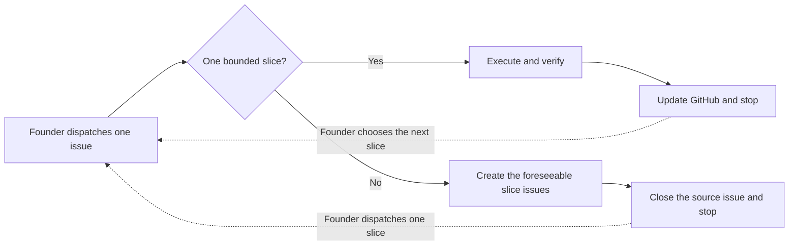

# Loop-Dee-Loup

An opinionated, token-lean way to run autonomous coding agents.

Loop-Dee-Loup (*loop dee loo*, or LDL in a hurry) keeps agent sessions short and disposable. GitHub holds the durable state. You give the agent one bounded issue, let it work until it finishes or genuinely needs you, and start the next slice in a fresh session.

The basic dispatch is one line:

> Run Loop-Dee-Loup issue #12.

If the issue is one executable vertical slice, the agent implements it, verifies it, updates GitHub, and stops. If the issue contains several independent slices, the agent creates those issues, closes the original, and stops without implementing any of them.



## Why I built it

Long coding-agent sessions get expensive in a very predictable way. The context keeps growing, the agent drags old work into new work, and the founder ends up relaying information that already exists somewhere else.

Think of it as needing to read your entire library every time you want to write a page.

Review can become its own little tennis match: find a problem, fix it, ask again, “You missed a spot,” repeat until you can't stand to look at your clean-ish code.

LDL handles this by treating the session as temporary and the repository as the record. Issues define the work. PRs and checks prove what happened. Compact snapshots preserve the state needed for the next session. The chat itself is allowed to disappear.

LDL shrinks that library down to one postcard containing only what the agent needs.

The goal is simple: get more verified work from the same token budget without turning you into a human API.

## Who this is for

LDL will probably fit if you want:

* lower token and context costs;
* fresh sessions instead of one conversation that never dies;
* GitHub issues, PRs, and repository docs as the durable record;
* high agent autonomy after you authorize the outcome;
* interruptions only for real founder decisions, credentials, or manual actions;
* batched decision forms instead of one question at a time;
* review cycles with an actual stopping condition.

It probably won't fit if you want heavyweight planning before any code is written, a highly conversational working session, or a general-purpose multi-agent platform. Version one has no daemon, queue, or automatic session launcher. Those aren't bad preferences. They just aren't mine.

## Try it

1. Clone this repository.

2. Run the bootstrap tool against your project. The project doesn't need to be new or empty:

   ```bash
   node tools/ldl-init/index.mjs --dest <path-to-your-project>
   ```

3. If the project already has an `AGENTS.md`, LDL writes its derived contract to `.ldl/AGENTS.template.md` instead of overwriting your file. Review that template and merge it into `AGENTS.md` by hand before dispatching work. If the project didn't have an `AGENTS.md`, the installer creates one for you.

4. Start Claude Code from inside the project and dispatch one issue:

   > Run Loop-Dee-Loup issue #12.

Read `docs/consumer-quickstart.md` for the complete setup and update process. Read `docs/consumer-contract.md` for the ownership boundary between LDL and your project.

Version one is written for Claude Code. WordBurner was my first LDL dogfood project. Covenant is the first project where I'm using it for professional work instead of personal entertainment. Both are examples, not dependencies.

## How the loop works

1. Capture the proposal in a GitHub issue.
2. Work out the currently visible critical path.
3. If founder decisions block the work, collect them in one decision form.
4. Turn the approved outcome into an executable vertical slice. If it needs several slices, create every currently foreseeable one and stop.
5. Start a fresh Claude Code session for one specific slice.
6. Let the agent implement and verify the whole slice without routine founder involvement.
7. Run the repository's required PR and bounded-review gates.
8. Merge when the gates pass. Audit when required. If the audit finds a real defect, create a correction slice.
9. Update the parent snapshot and stop at a clean boundary.
10. Start the next slice in a fresh session.

An issue is an external state machine. It isn't a replacement chat transcript.

## The vertical-slice rule

An execution issue should produce one observable capability, correction, or closure outcome.

It qualifies as a slice when:

* one agent session can own it with bounded context;
* it includes every layer needed for that outcome, including code, tests, configuration, documentation, and verification;
* it can be evaluated without finishing a sibling issue first;
* merging it leaves the repository in a coherent state.

Don't split one outcome into separate research, backend, UI, test, documentation, and PR-administration issues just because those are different activities. Keep them working together.

Create another issue when the outcome, authority boundary, or required context genuinely changes.

## The decomposition boundary

Sometimes an issue that looked like one slice turns out to contain several independently executable outcomes. When that happens, the current session becomes a decomposition session.

It must:

* create an implementation-ready issue for every slice whose shape is currently knowable;
* record real dependencies between those issues;
* close the source issue as the decomposition record;
* stop without implementing any resulting slice.

Don't create speculative issues whose requirements depend on work that hasn't happened yet.

Creating a slice does not authorize its execution. Completing one slice does not authorize the agent to start its sibling. I choose what runs next and dispatch it in a fresh session.

See `AGENTS.md` under **Decomposition boundary** for the repository-level rule.

## Founder decisions

LDL does not ask one question at a time when several known decisions can be handled together. This isn't 20 Questions.

Before asking me anything, the agent should inspect the proposal, repository rules, and visible critical path. If more than one founder-level question is already known, it creates one self-contained form that I can complete and return all at once.

Each question includes:

* why the answer changes or blocks the slice;
* two or three mutually exclusive options when appropriate;
* a recommended option and its tradeoffs;
* a suggested default answer;
* space for comments.

The form ends with a general comments field for anything it missed.

After I return it, the agent:

1. records the settled answers in the parent snapshot;
2. converts the critical-path outcome into executable slices;
3. routes accepted independent outcomes to the correct Burn Order;
4. drops rejected options instead of turning every idea into backlog work;
5. creates another form only if my answers exposed a new founder-level blocker that couldn't reasonably have been asked the first time.

If two rounds of forms still produce no executable slice, the problem is probably the proposal or the decomposition. Diagnose that before sending another questionnaire.

## What the agent handles on its own

Once I dispatch a slice, the agent owns routine technical decisions and handoffs within the authority already granted by the issue and repository.

It should not ask permission to:

* implement an accepted approach;
* run checks;
* fix a verified defect;
* prepare required review material;
* merge after every required gate passes.

It should stop and ask when the available authority cannot safely determine:

* the intended user or business outcome;
* a material scope, UX, monetization, legal, privacy, security, or irreversible tradeoff;
* credentials or a manual action only I can provide;
* what to do after a failed safety or correctness gate;
* whether a newly discovered opportunity belongs in the approved feature.

That is the distinction LDL cares about. Routine work stays autonomous. Founder judgment stays with the founder.

## Session communication

Claude Code chat is a control surface. It is not the permanent record.

A normal session should need only:

* a short kickoff acknowledgement;
* a question if real founder judgment or manual action is required;
* a concise completion or blocked handoff.

Evidence, decisions, status, and future work belong in the issue, PR, or repository docs. There is no reason to narrate the same state in chat several times. Again, there is no reason to narrate the same state in chat several times.

## Design rules

* One execution issue equals one subagent-sized vertical slice.
* A slice leaves the product and repository in a valid state.
* Research, implementation, tests, documentation, and review are activities inside a slice when they serve the same outcome.
* Decomposition and execution are separate sessions.
* Create every currently foreseeable slice, but don't invent a whole project hierarchy before the evidence exists.
* Sessions are disposable.
* Durable state is a compact snapshot, not a transcript.
* Verification evidence advances the loop. Status prose does not.
* Routine decisions become autonomous after dispatch.
* The target repository's safety, review, merge, and release rules remain authoritative.

## Using LDL in another repository

Run LDL from inside the project you are actually changing.

The Loop-Dee-Loup repository distributes the reusable machinery: skills, personas, scripts, and operating rules. Your project remains its own execution environment and source of truth.

In other words, don't run Covenant, WordBurner, or another project from inside the LDL repository. Install the required LDL pieces into that project, start the agent there, and keep its issues, PRs, decisions, and product state in its own repository.

See `docs/consumer-quickstart.md` for installation and `docs/consumer-contract.md` for exactly what LDL owns and what remains yours.

## Relationship to Vibecoding Common Sense

Loop-Dee-Loup and [Vibecoding Common Sense](https://github.com/LouPineWays/Vibecoding-Common-Sense) solve different problems.

Vibecoding Common Sense is a collection of safeguards for people using AI coding agents. It is meant to work with BMAD, informal agent use, long sessions, other orchestration systems, or whatever process you already have.

LDL is my specific way of organizing the work. It prioritizes low token cost, high agent autonomy, minimal founder interruption, disposable sessions, and durable GitHub state.

I don't expect everyone to prefer those tradeoffs. Someone who likes heavyweight planning or a long conversational session may reasonably prefer something else.

Different strokes for different folks, but LDL for me.

## Current evidence

LDL came out of real repository work, but it is still being tested. I am not claiming that it is universally better or proven at scale.

WordBurner was the first project I used to dogfood LDL. The first controlled professional trial covers Covenant's remaining `wolfscairn-list-and-privacy` work after PR #94. Covenant is a separate product repository that I own. LDL doesn't depend on it, and nobody adopting LDL needs to reproduce its stack.

The first execution slice ships the complete Buttondown signup surface on `covenant.wolfscairn.com`, including form behavior, CSP, presentation, tests, documentation, and repository integration. The live email interaction remains a founder-only external verification step.

The full trial design and its success and failure criteria are in `docs/operating-model.md` and `docs/experiment-brief.md`.

## Non-goals for version one

Version one does not include a daemon, queue, or automatic session launcher. The founder manually starts a fresh Claude Code session and names the issue to run.

That one-line dispatch is scheduling. It is not a routine approval gate.

Future automation may remove the manual launch step, but it must preserve the boundaries that matter: one authorized issue, fresh context, durable state, bounded execution, and a clean stop.

Now get to it. Here we go, Loop-Dee-Loup!

## License

MIT. See [LICENSE](LICENSE).
